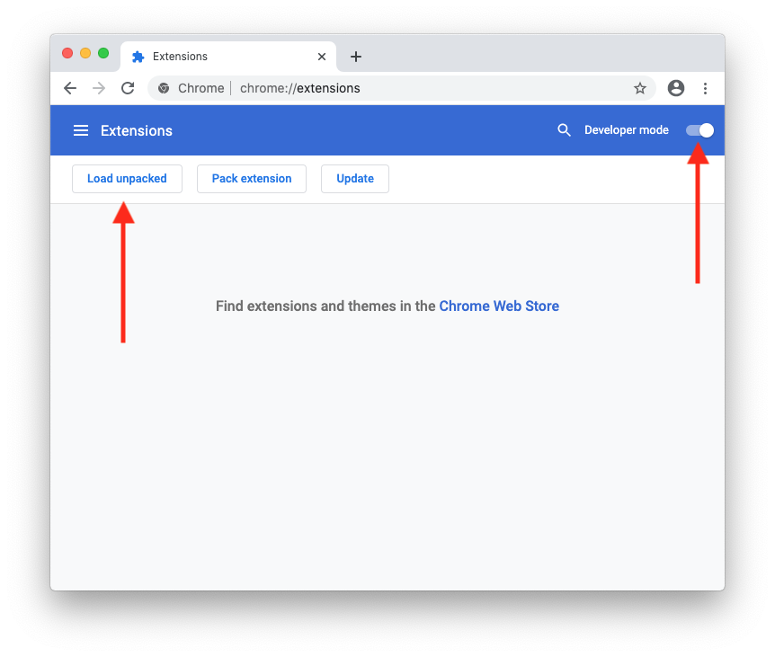
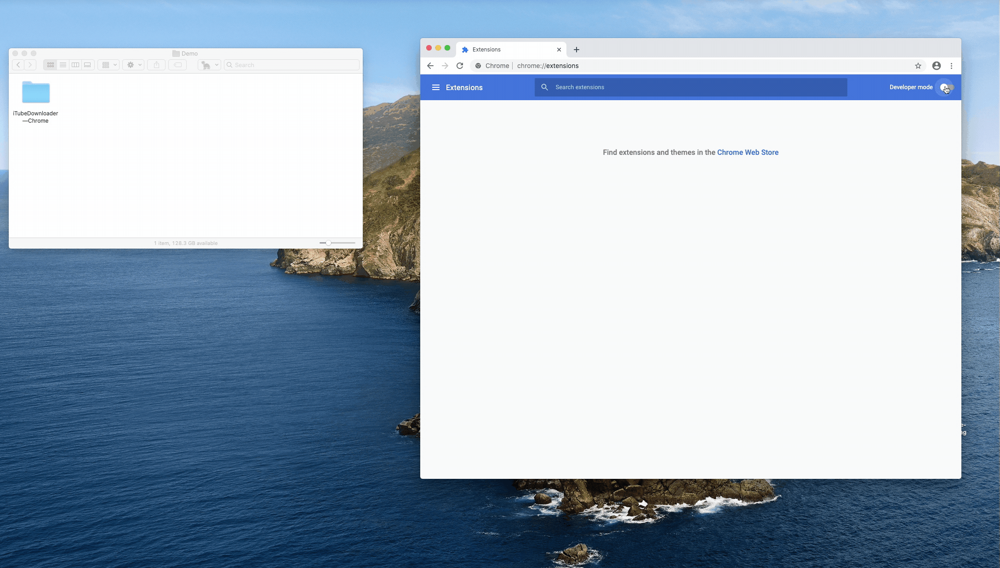

# iTubeDownloader Broswer Extensions
Web Browser Extension used my iTubeDownloader

## Installation

1. Download the extension [here](https://github.com/SoneeJohn/iTubeDownloader-Broswer-Extensions/releases/latest/download/iTubeDownloader.Chrome.zip) — once downloaded please double-click to unzipped the file if it hasn't already.
2. Store the extension on disk (do not delete it as Chrome will read it's content to run the extension, a good place to place this folder is in your `Documents` folder)
3. Enter this link in Chrome `chrome://extensions`, if you're using Brave use, `brave://extensions/`
4. In the top right-hand corner, turn on *Developer mode*, then click *Load unpacked*, select the `iTubeDownloader—Chrome` folder that you’ve downloaded and saved in Step 1 and confirm. 

(See the screenshot and gif below for more visual instructions.)

